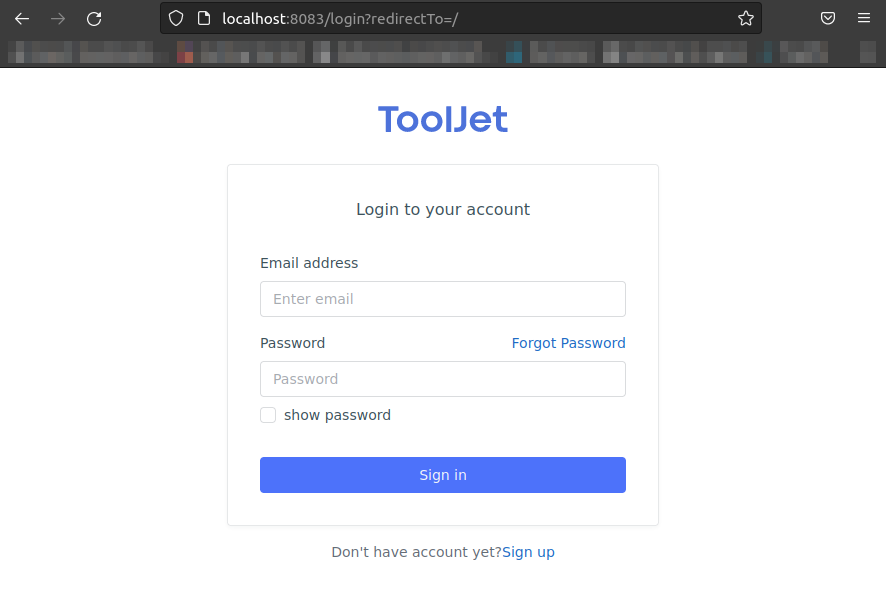

# A simple ToolJet test drive

*Date:* 2022-09-28  
*Author:* MvS  
*keywords:* low code platform, integration, dashboards, docker-compose

## Description

Setting up a local instance of the [ToolJet](https://docs.tooljet.com/docs) framework, which persists its data in a
pre-existing postgres-DB.

## How to use

1. Copy `.env.dist` to `.env` and add the following settings:
    * A pre-existing postgres instance with a user of sufficient priviledges needs
    to be supplied to the copy of the `.env` file
    * encryption keys need to be created

2. Run `make run-compose` and let the container come online.
3. Run an initialization script

    ```[bash]
    docker-compose exec tooljet_server npm run db:seed
    ```

4. Tooljet should be served under `http://localhost:8083` by default or the respective
local subdomain address.
5. Access to GUI via to following default credentials:

    ```[bash]
    email: dev@tooljet.io
    password: password
    ```


6. Use <kbd>CTRL</kbd>+<kbd>C</kbd> to shut down the stack
7. Invoke `make clean` to remove the stack
